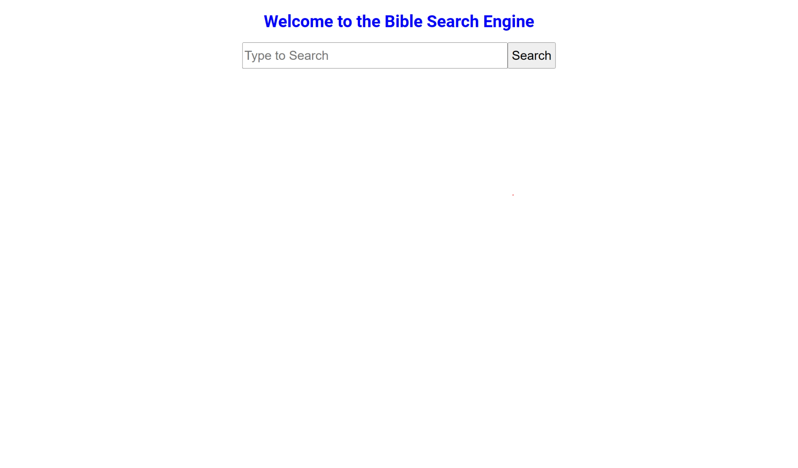
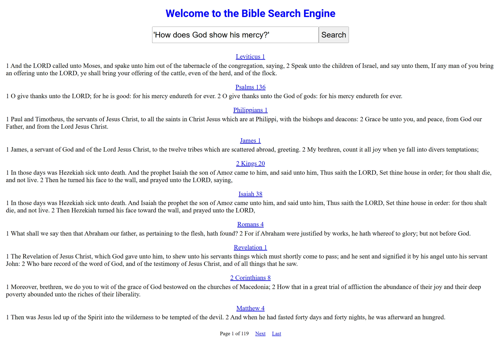
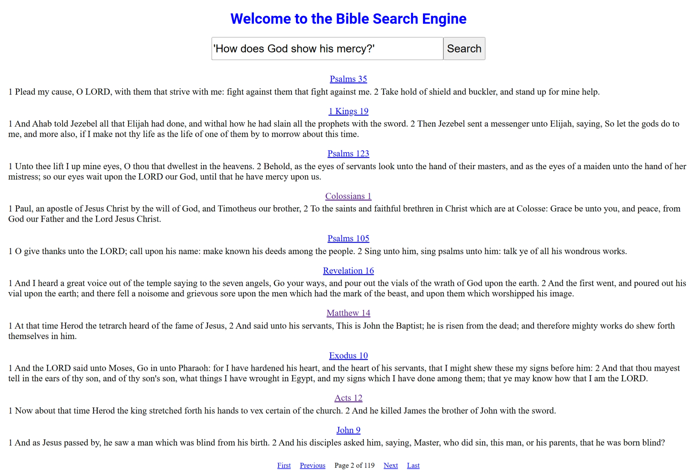

# Website
The link to the website is [https://biblesearchengine-ronenh24.koyeb.app/](https://biblesearchengine-ronenh24.koyeb.app/).

# Author
Ronen H  

# Time Frame
October 2023 to December 2023, March 2025 (add search interface with Django)

# Data Source
The text files for each book of the King James Bible can be accessed via [https://archive.org/details/kjv-text-files](https://archive.org/details/kjv-text-files).

# Bible Search Engine Backend
The backend for the Bible search engine ([link to Repo](https://github.com/ronenh24/bible_search_engine), [link to PyPI](https://pypi.org/project/bible-search-engine/)) incorporates Natural Language Processing, Deep Learning, and Machine Learning. It can be downloaded via.
```commandline
pip install bible-search-engine
```

# Environment
The necessary packages to run the Bible Search Engine can be installed on the terminal by.
```commandline
cd mysite
python -m pip install -r requirements
```

# How to Run Bible Search Engine
To run the Bible Search Engine locally on [http://127.0.0.1:8000/](http://127.0.0.1:8000/), run on the terminal
```commandline
cd mysite
python manage.py runserver
```



To search for the query "How does God show his mercy?", type it in the search bar and click search. It will return the ranked results with 10 per page.



# Improvements
- Decrease Memory Usage
- Track Online Interactions
